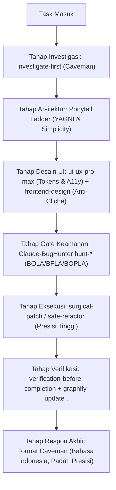

# Dental-Apps — Skill Orchestration & Unified Synergy Framework

Satu-satunya dokumen orkestrasi skill di proyek **Dental-Apps (Next-Gen Dental Practice Management System / PMS)**. Dokumen ini dirancang agar **seluruh skill yang terpasang saling bersinergi, saling melengkapi, dan tidak saling konflik atau bentrok**.

> [!IMPORTANT]
> **ATURAN WAJIB (ALWAYS ACTIVE):**
> Dokumen ini **wajib selalu dibaca dan dipatuhi secara otomatis pada setiap task** di proyek ini (`/Users/luky.septyan/Documents/PV Docs/Dental-Apps`), tanpa perlu diingatkan oleh user.

---

## 1. Inventori & Tanggung Jawab Ekosistem Skill Terpasang

Sumber kebenaran skill terpasang: `~/.gemini/config/skills/` (Antigravity IDE global) DAN `~/.claude/skills/` + `~/.claude/commands/` (Claude CLI global). Seluruh 5 kelompok skill telah terinstalasi lengkap dan siap berkolaborasi:

| Kelompok Skill | Anggota Utama | Peran & Tanggung Jawab | Larangan / Batasan |
| :--- | :--- | :--- | :--- |
| **Claude-BugHunter** | 83 skill: keluarga `hunt-*` (`hunt-idor`, `hunt-auth-bypass`, `hunt-nextjs`, `hunt-api-misconfig`, dll), `bug-bounty`, `security-arsenal`, `triage-validation` | **Defensive Security & Clinical Data Protection:** Memastikan kepatuhan OWASP API Top 10, perlindungan BOLA/IDOR pada data rekam medis pasien & odontogram, BFLA pada RBAC (Dokter, Perawat, Kasir, Admin), BOPLA pada mutasi tagihan/tindakan medis, serta sanitasi input. | Dilarang menghasilkan laporan bug bounty panjang berlembar-lembar atau melakukan aksi invasif ke pihak luar tanpa otorisasi. Hasil temuan dirangkum padat 1–2 baris. |
| **ponytail** | `ponytail`, `ponytail-audit`, `ponytail-debt`, `ponytail-gain`, `ponytail-help`, `ponytail-review` | **Senior Architecture & Code Minimization:** Standar senior engineer, YAGNI mutlak, menerapkan tangga minimalis (stdlib > native web > dependency existing > kode minimal), eliminasi overengineering, dan perbaikan akar masalah di shared layer. | **Persona percakapan mati total.** Dilarang menggunakan gaya bicara sinis, monolog panjang, atau keluhan "3 AM paging". Ponytail murni mesin logika internal. |
| **ui-ux-pro-max** | `ui-ux-pro-max`, `design`, `design-system`, `ui-styling`, `brand`, `banner-design`, `slides` | **UI Structure, Tokens & Accessibility Engine:** Implementasi palet klinis resmi (`color-palette.md`), kontras WCAG AA 4.5:1, touch targets (44×44px untuk tablet operator/dental chair), tata letak responsif, loading skeletons, dan status UI informatif. | Dilarang mengubah struktur service/backend logic di luar kebutuhan visual antarmuka. |
| **frontend-design** | `frontend-design` | **Distinctive Aesthetic & Anti-Cliché Gut-Check:** Arah estetika butik modern, pemilihan tipografi berkarakter (Inter/Outfit), tata letak intentional, mencegah "AI template look" (menolak warna biru RS usang, kartu SaaS seragam, atau gradient murahan). | Dilarang melanggar token semantik klinis `color-palette.md` atau fisika gerak `design-standards.md`. |
| **caveman** | `caveman`, `investigate-first`, `surgical-patch`, `safe-refactor`, `verify-and-stop`, `lean-build`, `migration`, `cavecrew`, dan utilitas `caveman-*` | **Communication Protocol & Surgical Execution:** Kompresi output tinggi, hemat token, berbasis fakta teknis, dipadukan dengan alur eksekusi presisi (`investigate-first` sebelum menulis kode, `surgical-patch` pada layer paling sempit). | Dilarang memotong/meringkas kode, diff, CLI commands, security alerts, atau istilah klinis medis. |

---

## 2. Resolusi Sinergi Antar-Skill (Bukan Konflik, Saling Melengkapi)

Untuk mencegah bentrokan instruksi, batas yurisdiksi tiap skill didefinisikan secara tegas:



### A. Sinergi Logika Internal vs Output Eksternal (`ponytail` + `caveman`)
- **Pembagian Tugas:** `ponytail` bekerja di dalam pikiran (*internal reasoning*) untuk merancang solusi paling sederhana dan minimalis. `caveman` bertugas mengemas hasil akhir ke user secara ultra-ringkas dan padat.
- **Titik Temu:** Keduanya sama-sama membenci *bloat* (ponytail benci kode berlebih; caveman benci kata berlebih). Sinergi ini menghasilkan kode yang sangat bersih dengan penjelasan yang to-the-point tanpa basa-basi.

### B. Sinergi Desain Sistem vs Estetika Butik (`ui-ux-pro-max` + `frontend-design`)
- **Pembagian Tugas:** `ui-ux-pro-max` menjadi pondasi aturan teknis: standar aksesibilitas WCAG AA, ukuran klik minimum 44px, struktur layout, dan validasi warna terhadap `color-palette.md`. `frontend-design` menjadi kurator rasa (*taste director*): memastikan tampilan klinik dental terasa tenang, bersih, modern, dan tidak terlihat seperti template buatan AI generik.
- **Resolusi Konflik:** Token warna dan semantik di `color-palette.md` adalah **hukum tertinggi**. `frontend-design` tidak boleh mengganti palet Deep Forest Teal (`#0F766E`) atau melanggar isolasi warna klinis odontogram, melainkan mengoptimalkan ritme visual dan tipografi di dalam koridor sistem tersebut.

### C. Sinergi Keamanan Medis vs Kode Minimalis (`Claude-BugHunter` + `ponytail`)
- **Pembagian Tugas:** `Claude-BugHunter` (lewat keluarga `hunt-*`) menentukan **APA** yang wajib diamankan (misal: validasi kepemilikan rekam medis pasien sebelum update). `ponytail` menentukan **BAGAIMANA** mengimplementasikannya secara paling ringkas (satu guard clause di service layer, bukan membungkus ulang seluruh framework auth).
- **Resolusi Konflik:** Keamanan klinis dan perlindungan data pasien tidak boleh dikurangi atas nama "kemalasan" atau penyederhanaan kode. Minimalisme ponytail diterapkan pada struktur kode yang menjalankan validasi keamanan tersebut.

### D. Sinergi Investigasi & Perbaikan (`investigate-first` + `surgical-patch` + `systematic-debugging`)
- **Alur Default:** Setiap bug/anomali wajib melalui `investigate-first` (baca kode, lacak referensi pemanggil, cari akar masalah) lalu diselesaikan dengan `surgical-patch` (perbaiki di titik simpul/shared layer agar seluruh pemanggil ikut sembuh).
- **Eskalasi ke `systematic-debugging`:** Hanya diaktifkan jika: (1) dua percobaan perbaikan sebelumnya gagal, (2) masalah bersifat intermiten/race-condition, atau (3) user meminta investigasi mendalam secara eksplisit.

---

## 3. Lima Aturan Supremasi Mutlak (Hierarchy of Authority)

Jika terjadi pertentangan instruksi dalam situasi apa pun, urutan prioritas di bawah ini berlaku mutlak:

1. **Bahasa Indonesia (Standing Rule):** Seluruh komunikasi, penjelasan teknis, dan ringkasan eksekusi wajib menggunakan Bahasa Indonesia.
2. **Supremasi Integritas Klinis & Keamanan Medis (Rule B — HIGHEST CODE PRIORITY):**
   - Perlindungan data pasien (HIPAA/GDPR compliance, BOLA, BFLA, BOPLA) dan isolasi semantik medis (warna karies odontogram dilarang keras dipakai untuk tombol/badge umum) menang atas kemudahan koding maupun estetika visual.
3. **Supremasi Arsitektur Minimalis (Rule C — Ponytail Ladder):**
   - Selalu cari solusi paling sederhana: gunakan fitur bawaan runtime/bahasa sebelum bikin fungsi baru; gunakan dependensi yang sudah terpasang sebelum tambah package baru; perbaiki akar masalah di shared utility daripada menambal setiap caller satu per satu. Tolak overengineering dan abstraksi prematur.
4. **Supremasi Format Komunikasi (Caveman Output Protocol):**
   - Format jawaban ke user: padat, to-the-point, hemat token, gaya *smart caveman*.
   - Pola baku: `[Komponen/Entitas] [Tindakan] [Alasan teknis/keamanan]. [Langkah berikutnya/Diff].`
   - **Pengecualian Absolut:** Kode, diff patch, command CLI, pesan error sistem, dan terminologi medis/gigi (SOAP, FDI notation, Odontogram) **DILARANG DIPOTONG ATAU DISINGKAT**.
5. **Supremasi Verifikasi Nyata & Knowledge Sync:**
   - Dilarang menyatakan suatu task selesai tanpa menjalankan perintah verifikasi nyata (`build`, `lint`, atau `tsc`).
   - Setiap modifikasi kode nyata pada modul/komponen wajib diakhiri dengan sinkronisasi graf arsitektur:
     ```bash
     graphify update .
     ```
     di root direktori `/Users/luky.septyan/Documents/PV Docs/Dental-Apps`.

---

## 4. Standar Spesifik Domain Dental-Apps (PMS Integration)

Setiap skill wajib menyesuaikan eksekusinya dengan dokumen spesifikasi proyek yang sudah ada:

### 4.1 UI/UX & Desain Klinis (`color-palette.md` & `design-standards.md`)
- **Filosofi Warna:** *Anti-Hospital Blue* & *Anti-Glare Canvas*. Gunakan **Deep Forest Teal** (`#0F766E`) dan **Vibrant Mint** (`#14B8A6`) pada canvas netral hangat **Soft Bone** (`#F8F9FA`).
- **Operatory Dim Mode:** Ruang tindakan gigi menggunakan mode gelap obsidian (`#090D16`) untuk mencegah pantulan silau saat dokter membaca rontgen atau memakai lampu UV curing.
- **Medical Semantic Isolation:** Warna indikator klinis gigi (karies `#DC2626`, tumpatan komposit `#2563EB`, perawatan saluran akar `#D97706`, kalkulus `#CA8A04`) **hanya boleh tampil pada odontogram/rekam medis klinis**, tidak boleh menjadi background tombol umum.
- **Motion Physics:** Animasi wajib tunduk pada **Damped Spring Physics** (Stiffness `350`, Damping `32`, Mass `0.8`, Durasi `220ms–280ms`, translasi maksimal `24px–32px`). Tab navigasi klinis wajib menggunakan *direction-aware sliding* dengan *magnetic pill*.

### 4.2 Kualitas & Integritas Data (`security_and_quality.md`)
- **Zero Mock Data in Active Flows:** Dilarang menampilkan data dummy atau placeholder hardcoded pada alur aktif rekam medis, odontogram, jadwal janji temu, dan pembayaran kasir. Jika data kosong, tampilkan *genuine empty state* atau *loading skeleton*.
- **Comprehensive E2E Impact Analysis:** Setiap kali mengedit fungsi atau skema status pasien, telusuri dampaknya ke seluruh layer (Supabase RLS, Service, State, Odontogram canvas, Tab layout, hingga Route guard).
- **Zero Stale Cache:** Pastikan cache client-side sinkron seketika dengan database menggunakan Supabase Realtime synchronization atau revalidasi aktif.
- **Standar Dokumentasi Modular (`docs/modules/`):** Dokumentasi detail teknis wajib dibuat terpisah per file (`docs/modules/<nomor>-<nama-modul>.md`) dengan indeks di `docs/README.md`. Dilarang menyatukan dokumentasi mendalam ke dalam 1 file raksasa untuk efisiensi token LLM dan presisi node Graphify.

---

## 5. Matriks Alur Kerja per Jenis Tugas (Workflows)

| Jenis Tugas | Urutan Skill yang Dieksekusi | Output & Standar Selesai |
| :--- | :--- | :--- |
| **Bugfix Rutin** | `investigate-first` → `surgical-patch` (akar masalah di shared utility) → `verification-before-completion` | Patch minimal, verifikasi lolos, ringkasan caveman 1–2 baris. |
| **Bugfix Kompleks / Gagal Berulang** | `investigate-first` → eskalasi `systematic-debugging` (lacak state & race condition) → `surgical-patch` | Bukti akar masalah terisolasi, patch teruji, verifikasi lulus. |
| **Fitur Rekam Medis / API / Auth / Pasien** | `hunt-*` relevan (`hunt-idor`, `hunt-auth-bypass`, `hunt-nextjs`) → `ponytail` ladder (arsitektur minimal) → `surgical-patch` → `verification-before-completion` | Validasi kepemilikan ID pasien (BOLA safe), RBAC safe, tipe data strict (Zod/TypeScript), zero data leak. |
| **Pembuatan / Refactoring Komponen UI** | `ui-ux-pro-max` (cek tokens & a11y) + `frontend-design` (anti-cliché check) → implementasi Framer Motion damped spring → verifikasi responsive | Sesuai `color-palette.md` & `design-standards.md`, touch target ≥44px, loading/empty states lengkap. |
| **Refactoring & Cleanup Kode** | `ponytail-audit` (identifikasi dead code/abstraksi berlebih) → `safe-refactor` (pertahankan 100% kontrak & perilaku) | Diff bersih, tidak ada dead code, build & test lulus tanpa regresi. |
| **Audit Keamanan Mandiri** | Ekosistem `Claude-BugHunter` (`bb-methodology` → `hunt-*` pada route/service lokal → `triage-validation`) | Checklist kerentanan terverifikasi, rekomendasi guard clause konkret tanpa report sampah. |
| **Dokumentasi Teknis Modul** | `ponytail` (hilangkan fluff/bloat) → tulis/update modul terpisah di `docs/modules/<nomor>-<nama>.md` → update `docs/README.md` | Dokumentasi modular 5-seksi, token-efficient, node Graphify presisi. |
| **Pemeriksaan / Validasi Saja** | `verify-and-stop` (jalankan check tanpa mengubah kode apa pun) | Laporan status akurat apa adanya tanpa *false all-clear*. |

---

## 6. Protokol Eksekusi & Commit Perubahan

Setiap task di proyek ini wajib diakhiri dengan langkah verifikasi dan pencatatan yang konsisten:

1. **Jalankan Verifikasi Lokal:**
   ```bash
   npm run build # atau tsc --noEmit && npm run lint
   ```
2. **Sinkronkan Graphify Knowledge Graph:**
   ```bash
   graphify update .
   ```
3. **Penyampaian Hasil (Gaya Caveman Berbahasa Indonesia):**
   - Format: `[Modul/Komponen] [Aksi yang dilakukan] [Alasan teknis/keamanan]. [Langkah verifikasi/Status].`
   - Contoh:
     > *"Komponen `OdontogramTooth` diperbaiki. Normalisasi FDI tooth numbering dipindahkan ke `tooth-utils.ts` agar konsisten di seluruh chart. Verifikasi `npm run build` dan `graphify update .` sukses."*
